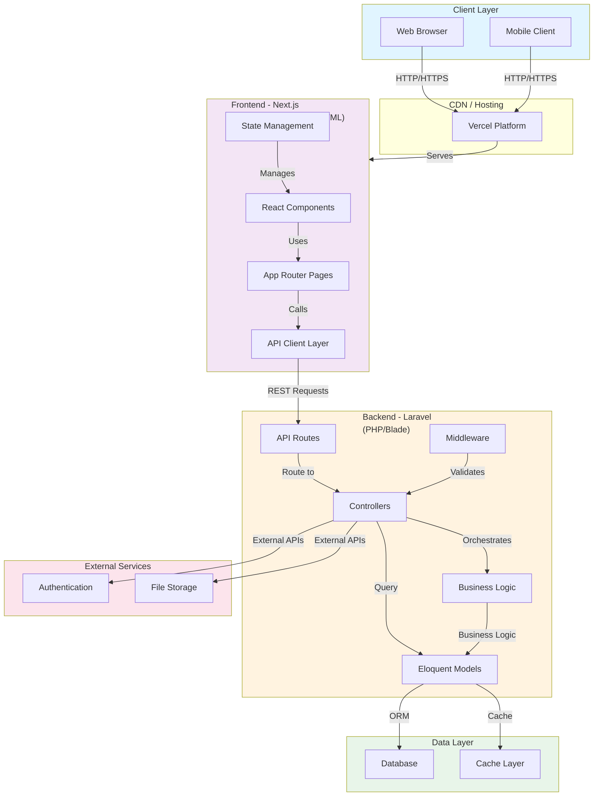

# PetPosture Architecture Overview

This document provides a high-level overview of the PetPosture application architecture, which combines a modern Next.js frontend with a Laravel backend API.

## System Architecture



## Technology Stack

### Frontend
- **Framework**: [Next.js](https://nextjs.org/) - React-based full-stack framework
- **Language**: TypeScript (23.2%), JavaScript (23%), HTML (23%)
- **Deployment**: [Vercel](https://vercel.com/) (homepage: https://petposture-lunarphp.vercel.app)
- **Features**:
  - Server-side rendering (SSR)
  - Static site generation (SSG)
  - API routes for backend integration
  - Optimized image and font loading

### Backend
- **Framework**: [Laravel](https://laravel.com/) - PHP web framework
- **Language**: PHP (17.8%), Blade templating engine (2.4%)
- **Key Components**:
  - RESTful API endpoints
  - Eloquent ORM for database abstraction
  - Laravel middleware for request/response handling
  - Service layer for business logic
  - Built-in authentication & authorization

### Data Layer
- Database (specific engine to be determined)
- Cache layer support (Redis, Memcached, etc.)

### Additional Languages
- **Python** (9%) - Likely used for backend utilities, data processing, or deployment scripts

## Directory Structure

```
petposture-lunarphp/
├── frontend/               # Next.js application
│   ├── app/               # App Router pages and layouts
│   ├── components/        # Reusable React components
│   ├── lib/               # Utility functions and API clients
│   └── public/            # Static assets
│
├── backend/               # Laravel application
│   ├── app/
│   │   ├── Http/          # Controllers, Middleware, Requests
│   │   ├── Models/        # Eloquent models
│   │   ├── Services/      # Business logic layer
│   │   └── Jobs/          # Queue jobs
│   ├── routes/            # API route definitions
│   ├── database/          # Migrations and seeders
│   └── config/            # Configuration files
│
└── docs/                  # Documentation
```

## Communication Flow

### Request/Response Cycle

1. **Client Request**: User interacts with frontend → Next.js component dispatches API call
2. **Frontend Processing**: API client layer formats request with headers, authentication
3. **Network Transit**: HTTPS request sent to Laravel backend
4. **Backend Processing**:
   - Route matching
   - Middleware processing (CORS, authentication, validation)
   - Controller execution
   - Service layer business logic
   - Database queries via Eloquent ORM
5. **Database Operations**: Query execution, caching
6. **Response Creation**: JSON response formatted by controller
7. **Frontend Reception**: React component receives data, updates state
8. **UI Rendering**: Component re-renders with new data

## Key Features & Services

### Authentication & Authorization
- Handled primarily by Laravel backend
- JWT or session-based authentication
- Protected routes and API endpoints

### API Communication
- RESTful endpoints exposed by Laravel
- Consumed by Next.js frontend
- JSON request/response format

### State Management
- Frontend: React hooks, Context API, or state management library
- Backend: Session/Cache layer for session state

### Data Persistence
- Primary: Relational database
- Secondary: Cache layer for performance optimization

## Deployment

- **Frontend**: Hosted on Vercel platform
- **Backend**: Deployed separately (on traditional server, cloud platform, or containerized)
- **Database**: Cloud-hosted or self-managed database service

## Development Workflow

1. Frontend development with `npm run dev` (Next.js dev server on localhost:3000)
2. Backend development with Laravel development server
3. API client makes requests to backend during development
4. Production deployment:
   - Frontend: Automatic deployment to Vercel
   - Backend: Manual or CI/CD deployment

## Performance Considerations

- Next.js optimization of fonts and images
- Frontend caching strategies
- Backend query optimization
- Database indexing and caching
- CDN delivery via Vercel

---

*For more information on specific components, see README files in the `frontend/` and `backend/` directories.*
